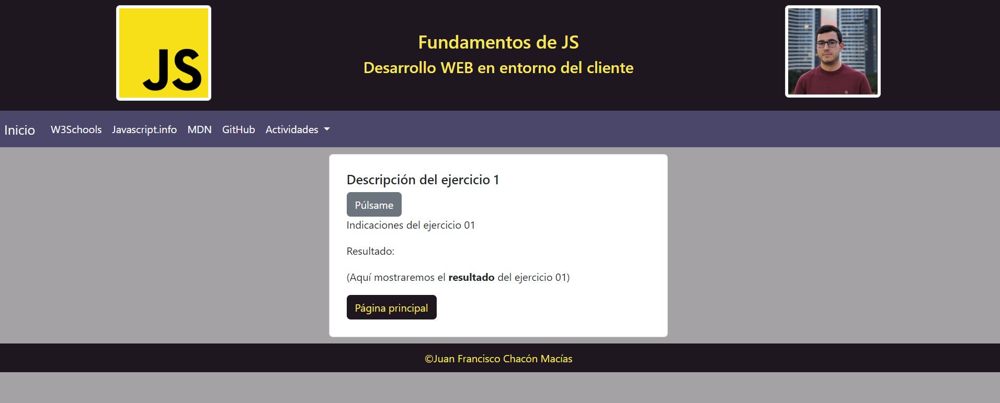
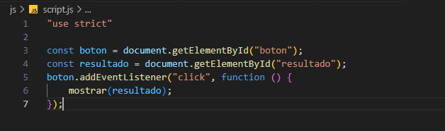
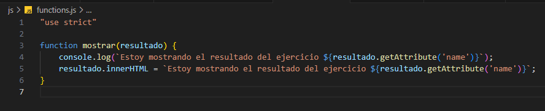

# DWECRepositorie

<h1>Entrega inicial plantilla03</h1>

-   Estilo mediante combinación de css y bootstrap

<h2>-   Funciones usadas de js en las actividades 01-02:</h2>

<h3>-   Archivo scripts.js:</h3>

-   Usamos getElementById para localizar el elemento botón y resultado, y de esta forma poder realizar una escucha al botón y cuando esto ocurra mostrar el resultado el la posición del elemento resultado mediante la función de functions.js

<h3>-   Archivo functions.js</h3>

-   Usamos un console.log para saber por consola que se ha ejecutado la función correcta y modificamos el valor del html del elemento resultado por una frase predeterminada en la que extrae el número del ejercicio mediante getAttribute sobre el valor del nombre, que varía en función del ejercicio.