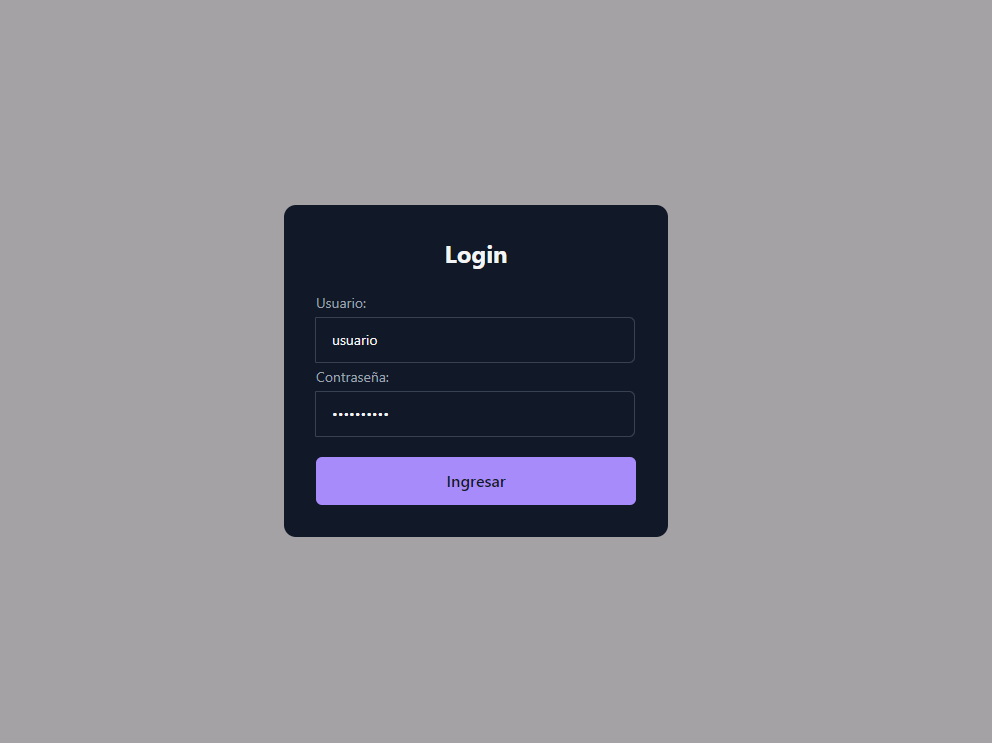

# DWECRepositorie

<h1>Entrega inicial plantilla03</h1>

-   Estilo mediante combinación de css y bootstrap

<h2>-   Funciones usadas de js en las actividades 01-02:</h2>

<h3>-   Archivo scripts.js:</h3>

-   Usamos getElementById para localizar el elemento botón y resultado, y de esta forma poder realizar una escucha al botón y cuando esto ocurra mostrar el resultado el la posición del elemento resultado mediante la función de functions.js

<h3>-   Archivo functions.js</h3>

-   Usamos un console.log para saber por consola que se ha ejecutado la función correcta y modificamos el valor del html del elemento resultado por una frase predeterminada en la que extrae el número del ejercicio mediante getAttribute sobre el valor del nombre, que varía en función del ejercicio.

<h1>Entrega Login ventanas</h1>

<h2>-   Funciones usadas de js en la validación del login</h2>

- La función login que es llamada desde scripts.js produce dos prompts solicitando usuario y contraseña al usuario, para luego validarlos con los valores almacenados en las constantes. En caso de coincidir, se saldrá del bucle de comprobación y se accederá al contenido.

- En caso de introducir las credenciales incorrectamente, se emitirá una señal de alerta avisándonos de ello

- Posteriormente, si decidimos pulsar volver a intentarlo continuaremos dentro del bucle de comprobación un intento más cada vez que lo pulsemos, o en caso de denegar el reintento saldremos del login pero no se cargará el contenido principal de la página

<h1>Entrega Login con formulario</h1>

<h2>-   Funciones usadas de js en la validación del login</h2>

<h2>-  Estructura form html</h2>

- Partiendo del apartado anterior, recogemos mediante el uso de document.getElementById las entradas del formulario, el contenedor del form, y el contenedor del contenido completo de la página.

-   Mediante un query selector creamos una constante referente al botón del formulario, a la cual le ponemos un Listener para detectar cuando el usuario haga click en enviar la información y así comenzar el proceso de autenticación.

-   Dentro de la función comprobamos que el contenido obtenido en cada uno de los campos es el correcto, si es así lanzamos un mensaje de bienvenida y mostramos el contenido de la página cambiando el display de este.

-   En caso de no acertar las credenciales se emitirá un mensaje de error

