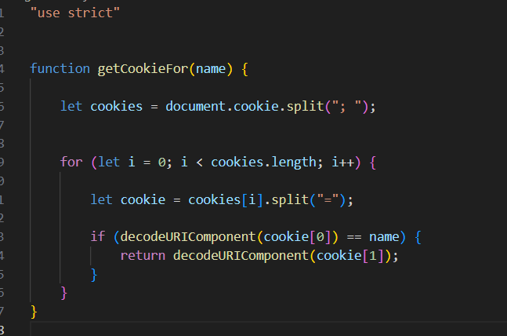
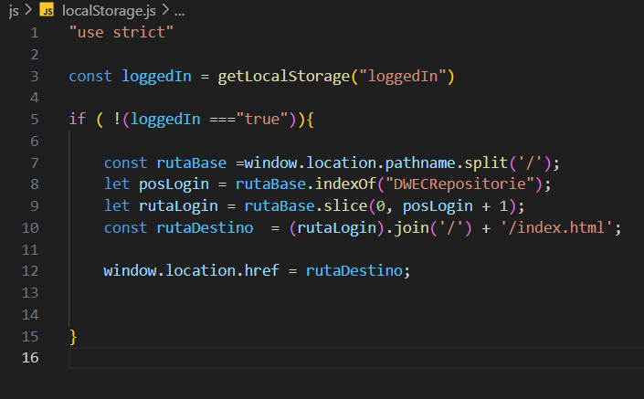

# DWECRepositorie

<h1>E01 Entrega inicial plantilla03</h1>

-   Estilo mediante combinación de css y bootstrap

<h2>-   Funciones usadas de js en las actividades 01-02:</h2>

<h3>-   Archivo scripts.js:</h3>

-   Usamos getElementById para localizar el elemento botón y resultado, y de esta forma poder realizar una escucha al botón y cuando esto ocurra mostrar el resultado el la posición del elemento resultado mediante la función de functions.js

<h3>-   Archivo functions.js</h3>

-   Usamos un console.log para saber por consola que se ha ejecutado la función correcta y modificamos el valor del html del elemento resultado por una frase predeterminada en la que extrae el número del ejercicio mediante getAttribute sobre el valor del nombre, que varía en función del ejercicio.

<h1>E02 Entrega Login ventanas</h1>

<h2>-   Funciones usadas de js en la validación del login</h2>

- La función login que es llamada desde scripts.js produce dos prompts solicitando usuario y contraseña al usuario, para luego validarlos con los valores almacenados en las constantes. En caso de coincidir, se saldrá del bucle de comprobación y se accederá al contenido.

- En caso de introducir las credenciales incorrectamente, se emitirá una señal de alerta avisándonos de ello

- Posteriormente, si decidimos pulsar volver a intentarlo continuaremos dentro del bucle de comprobación un intento más cada vez que lo pulsemos, o en caso de denegar el reintento saldremos del login pero no se cargará el contenido principal de la página

<h1>E03 Entrega Login con formulario</h1>

<h2>-   Funciones usadas de js en la validación del login</h2>

<h2>-  Estructura form html</h2>

- Partiendo del apartado anterior, recogemos mediante el uso de document.getElementById las entradas del formulario, el contenedor del form, y el contenedor del contenido completo de la página.

-   Mediante un query selector creamos una constante referente al botón del formulario, a la cual le ponemos un Listener para detectar cuando el usuario haga click en enviar la información y así comenzar el proceso de autenticación.

-   Dentro de la función comprobamos que el contenido obtenido en cada uno de los campos es el correcto, si es así lanzamos un mensaje de bienvenida y mostramos el contenido de la página cambiando el display de este.

-   En caso de no acertar las credenciales se emitirá un mensaje de error

<h1>E04 Entrega cookies + number</h1>

En esta entrega he modificado el login para que funcione junto con las cookies, he añadido y manejado cookies, añadido la función de logeout, e implementado dos actividades de Number llamadas minicalculadora y conversor de bases

<h2>Cookies</h2>
<h3>cookie.js</h3>

En primer lugar el cookie.js comprueba cada vez que se accede a una nueva página si la cookie de inicio de sesión existe, y si no es así nos dirige automáticamente al index.html del login, independientemente de la localización en la que nos encontremos.

Para realizar la dirección correcta al login, con la función window.location.pathname cogemos la localización actual en la que nos encontremos, independientemente del sistema en el que nos encontremos.

Posteriormente, cortamos esta ruta por los caracteres que separan los directorios (/) con .split resultando en un array, para luego encontrar el index del repositorio que contiene el login (alojado en el contenido principar) y quedarnos hasta este(en slice usamos una posición más para quedarnos con la deseada), y posteriormente usamos join('/') para volver a unir los fragmentos y añadimos la dirección final al login.

Una vez obtenida la dirección absoluta independientemente del sistema en el que nos encontremos, podremos dirigirnos al login sin importar en que ubicación nos encontremos en el directorio

<h3>setCookie.js</h3>

Teniendo el valor de provisional de caducidad preestablecido, esta función genera una cookie con un nombre y valor determinados, esetableciendo el tiempo de expiración (1 min) respeto a la hora actual. Todo esto siempre que el navegador permita el manejo de cookies

<h3>getCookie.js</h3>

Esta función busca en las cookies actuales la cookie que especifiquemos en name al llamar la función, recorriendo el conjunto de cookies como un array después de dividir el conjunto con la función split

<h3>deleteCookie.js</h3>

Al llamar a la función deleteCookie, recorremos el string de cookie en forma de array tras el split como en getCookie, hasta llegar al especificado y modificar su tiempo de expiración

<h2>Nuevo Login</h2>

<h3>Ubicación y funciones añadidas</h3>

Este nuevo login está en un archivo html independiente del resto de archivos, algunas funciones mejoradas son el mensaje de bienvenida dentro del mismo login y autorellenado de los inputs al perder el foco

<h3>Inicio y creación cookie</h3>

Al realizar un login correcto, generamos una cookie con el nombre de "loggedIn" valor "true" que luego nos servirá en cookie.js para saber si hemos iniciado sesión o no en el resto de páginas.

 Posteriormente desactiva los campos del login y carga la página de inicio con un timeout

<h3>Impedir volver atrás desde login</h3>

Un problema presente en este ejercicio era que una vez caducaba la cookie, o hacíamos logout, una vez ya redireccionados al login podíamos desde el navegador volver a ir a las direcciones accedidas anteriormente a la elimicación de la cookie, las cuales al haber sido validadas al entrar en su momento no requieren que vuelvan a ser validadas ya que solo ejecutan la comprobación al entrar

Para evitar esto y no consumir muchos recursos como hubiese requerido mirar de forma constante si está la cookie o no, una vez en el login con push state eliminamos el historial anterior de acceso, y además impedimos volver a la ventana anterior con un Listener a la ventana en si a la acción popstate, redireccionándonos en este caso a la misma página de login

<h2>Nuevo menú principal</h2>

<h3>Botón de logout</h3>

En toda la web contamos con un botón de cerrar sesión en la esquina superior derecha, el cual eecuta el código de logout.js. Este elimina la cookie creada en login y nos redirecciona a la página de login de la misma forma que lo hace cookie.js al no detectar la cookie de login

<h3>Load Exercise</h3>

Al menú principal está asociado por una parte el script.js de su directorio que tendrá Listener en las opciones del nav desplegable dando a elegir entre las dos tareas de esta entrega, minicalculadora y conversor de bases. Al detectar click ejecutará el código de loadExercise.js

Al recibir la señal este archivo js cargará según la opción elegida desde el navbar el contenido de la introducción a la tarea en cuestión, todo sin salirse del mismo archivo html del menú principal usando innerHTML

Desplegable

Tarjeta de minicalculadora

<h2>Minicalculadora</h2>

<h3>Funcionamiento gráfico</h3>

Esta calculadora nos permite escribir dos números en la parte superior, para luego realizar alguna de las operaciones al pulsar el botón correspondiente y luego mostrar en resultado el resultado de dicha operación. Incluye suma, resta, multiplicación, división, resto y factorial. Por otra parte cuenta con el selector de la parte entera que será colocada en el valor izquierdo superior, y de la parte decimal en el derecho.

<h3>Script.js de minicalculadora</h3>

Todos los operadores de la calculadora están dentro de la clase operadores. Mediante un getElementsByClassName cogemos el conjunto de botones operadores y luego hacemos un forEach para un evento Listener y captar el click en los botones. Al hacerlo desencadena la función selectorOperador a la cual se le envía el operador que ha recibido el click

<h3>Functions.js de minicalculadora</h3>

Siguiendo el siguiente paso al script.js, esta función toma el id de dicho operador (suma, resta, resto...), y según el id que sea (operador, parte entera, o decimal) modifica una parte u otra del html obteniendo el resultado de la función operar explicada en la siguiente imagen

Si es una operación, cambiará el contenido en el html con el resultado obtenido de la operación. Si es quedarse ccon la parte entera, tomará el valor entero del resultado y lo pondrá en el primer valor...

La función operar recibe dos valores, los cuales no tienen por que ser los valores introducidos por el usuario (Ej coger parte entera o decimal), junto con un indicador de la operación a realizar que coincide con el id que cada botón tiene, de esta forma al pulsar sumar, llega a operar con el id sumar y en el switch ejecuta el contenido del case "sumar", devolviendo el valor de la suma

<h2>Conversor de bases</h2>

El conversor de bases nos devuelve el valor introducido en base 2(binario), 8(octal), o 16(hexadecimal) según el botón correspondiente que pulsemos

<h3>Script de conversor de bases</h3>

El código del conversor en muy simple. Creamos listeners a cada botón, y al pulsar cada uno con la función toString(base) nos devuelve automáticamente el resultado de ese número en la base que indiquemos.

<h1>E05 LocalStorage con string</h1>

<h2>Modificar texto</h2>

Para esta entrega en los menús anteriores solo hemos añadido al navegador la opción de String junto con sus dos actividades respecto a la tarea de string

En el apartado del modificador de texto hemos puesto un recuadro de texto donde se puede escribir, junto con una serie de botones que cambian a mayúsculas o minúsculas las letras de este texto de diferentes maneras, siendo A-Z todas a mayúsculas, _a la última letra de cada palabra a minúscula, CONST todas las consonantes a mayúscula...

De la misma forma también incluye una segunda serie de botones cuyo funcionamiento está realcionado con números aleatorios y llamadas periódicas a funciones, llamando al pulsar uno de estos a las opciones superiores de forma aleatoria cada diferentes lapsos de tiempo, y stop que detiene el proceso

Para el apartado de llamadas continuas he dejado una salida por pantalla de la opción aleatoria que se ha seleccionado y del cambio en consola ya que a veces algunos botones solapan parte de sus funciones y se puede pensar que no funciona correctamente(Ej todo mayus y posteriormente última letra a mayus)

<h3>Código de funcionamiento</h3>

En primer lugar, he refactorizado el script de manejo de minicalculadora para que se pueda emplear también en las actividades de STRING, siendo este archivo común entre las tres actividades.

Su función es localizar en el html los botones y añadirles un listener al hacer click, ejecutando el script propio que tiene cada uno llamado functions.js

<h3>Functions.js común entre actividad con y sin API</h3>

En primer lugar diferenciamos los operadores en los relacionados con llamada continua a función y los relacionados con string, llamando cada uno de estos a 2 posibles funciones

<h3>Operadores String</h3>

En el caso de los operadores de string, diferenciamos que botón hemos pulsado en el switch mediante el id

Partienddo del uso básico de toLowerCase() y toUpperCase, en upperFirst separamos el texto mediante los espacios y mapeamos cada uno de los valores del string creado, aplicándole a cada uno la función lamda indicada, cambiando de cada uno de ellos la primera letra a mayúscula y luego añadiéndole el resto de la palabra

En lowerFirst tiene el mismo funcionamiento, y en upper/lowerLast el mecanismo es el inverso, primero nos quedamos con el resto de la palabra menos con la última posición con .slice y posteriormente cogemos la última letra y la añadimos modificada.

Para upper/lowerVocal y Const, separamos en vez de por palabra(" ") por letra(""), y posteriormente comparamos al mapear si la letra es una vocal minúscula o mayúscula

En el caso de -Vocal las modificamos según si son lo que buscamos (minus o mayus), transformándo las encontradas o quedándonos con el caracter si no coincide mediante un ternario.

En el caso de las consonantes usamos la aplicación contraria. Al pasar las consonantes a mayúscula, comprobamos que no sea una vocal minúscula, en caso de serlo la dejamos tal cual, y en caso de no serlo la ponemos en mayúscula ya que no hace efecto en las vocales mayúsculas al estar ya en mayúsculas

<h3>Funciones intervalo</h3>

Para las funciones intervalo primero diferenciamos cual hemos seleccionado, lo cual hace variar el tiempo en milisegundos con el que llamamos a la función que ejecuta el intervalo. Por otra parte el stop elimina el intervalo

Por otra parte la función intervalo si el intervalo ya ha sido creado lo elimina para crear uno nuevo(si no los botones añadirían un nuevo intervalo cada click) y luego crea el intervalo de la función llamadaAleatoria cada x milisegundos que hayamos indicado

Finalmente llamadaAleatoria llama a las funciones string de forma aleatoria según el array que tiene indicado encima según la posición de estos. Al crear un número entre 0-9, luego este número es empleado dentro del array para indicar el índice del que se quiere devolver el valor para llamar a la función operar como si fuese el índice.

<h2>Modificar texto + API **Sin terminar** Sujeto a modificaciones</h2>

Esta función no está completa, pero es funcional. Le falta complejidad que será añadida en otra entrega.

Al pulsar el nuevo botón Joke hace una petición a una Api y esta devuelve una broma. Si continúo con esta api en el futuro estará disponible la opción de elegir el tipo de broma entre otras cosas.

<h3>Funcionamiento MT + API</h3>

Mediante una función asíncrona, hacemos una llamada a la api mediante await fetch, y al recibir respuesta en json nos quedamos con los apartados de setup("inicio de la broma"), y puchline("desenlace de la broma"), que son introducidos en el value del contenedor de texto.

En caso de error lo que se muestra en el contenedor de texto es el mensaje de que ocurrió un problema

<h2>Local Storage</h2>

En esta actividad hemos modificado el manejo de sesión mediante cookies por localStorage, siendo mucho más sencillo de usar y manteniéndose entre ventanas del navegador. Aún así el funcionamiento es muy similar a cookies en lo referente a archivos necesarios y estructura de funciones.

<h3>Modificaciones a Login</h3>

En el caso de login, en vez de generar una cookie a la hora de validar correctamente el usuario y la contraseña, generamos mediante la función setLocalStorage el valor true para loggedIn.

<h3>setLocalStorage.js</h3>

Para establecerlo, simplemente hacemos uso de setItem(nombre, value), estableciendolo de esta forma.

<h3>getLocalStorage.js</h3>

Es usado en el logout y el comprobador de que se ha iniciado sesión (localStorage.js). Busca en el localStorage mediante getItem a través del nombre que indiquemos y en caso de no existir devuelve que el valor es nulo

<h3>deleteLocalStorage.js</h3>

Elimina un item del local storage mediante su nombre

<h3>localStorage.js</h3>

Comprueba cada vez que se accede a una página de la web que el valor de loggedIn en el local storage es true, y en caso contrario te redirecciona al loggin

<h3>logout.js</h3>

Al pulsar el botón de logout, se elimina el valor de loggedIn y se recarga la página actual, de esta forma entra en acción localStorage.js y este te redirecciona a la página del login. Al realizarlo de esta forma, evito escribir dos veces la redirección al login como ocurría en cookies

<h1>E06 IndexedDb con array</h1>

<h2>IndexedDB</h2>

Para esta entrega, he reformulado los archivos anteriores de validación y almacenaje aplicando el uso de indexedDB

<h3>indexDB.js</h3>

La principal diferencia al usar indexedDB es que debemos realizar las funciones de forma asíncrona usando promesas. Esto se debe a que tarda unos breves instantes en iniciarse, lo cual produce fallos a la hora de realizar comprobaciones instantáneas sobre si existe o no un campo en la base de datos(loggedIn en este caso)

En el caso de indexDB hacemos que al llamar a la función de abrir la base de datos se devuelva una promesa, produciendose la apertura de forma asíncrona

A la hora de volver a abrir la base de datos abierta desde otra pestaña, se comrpueba si existe la base de datos dentro de este espacio de memoria, y en caso de no existir se crea.

<h3>getIndexDB.js</h3>

En el caso de getIndexDB, esta función es asíncrona ya que espera a la creación o apertura previa de la base de datos, en caso de abrirse corectamente, buscamos el valor y lo devolvemos en caso de encontrarlo, y en caso contrario devolvemos null.

<h3>deleteIndexDB.js</h3>

Para eliminar un valor de una clave especificada de la base de datos no requerimos que sea asíncrona ya que este caso solo va a tener lugar cuando pulsemos el botón de logout, lo cual da tiempo suficiente al sistema a abrir la base de datos

<h3>setIndexDB.js</h3>

Parecido a delete, como para crear par clave:valor sería necesario hacer login, no es necesario hacerla asíncrona

<h3>logout.js</h3>

En el logout he agregado la función que comprueba al entrar en una página si la clave:valor loggedIn:true existe, y para ello debemos hacerla asíncrona, ya que depende de una función(getIndexDB) que a su vez depende de la apertura de la base de datos

<h3>login.js</h3>

En el caso del login solo cambiamos a setIndexDB a la hora de validar credenciales

<h2>Array</h2>

En la parte de arrays las hemos empleado para realizar operaciones de sumar, restar y multiplicar matrices

<h3>index.html</h3>

Hacemos una estructura inicial de tablas para mostrar el resultado de manera más ordenada

<h3>script.js</h3>

Partiendo de que comparte como los otros ejercicios el arrays con el conjunto de botones en el mismo script común ya mostrado anteriormente,  creamos la función a la que este script común llama, selectorOperador.

Desde ESte seleccionamos si la operación a realizar será una operación matemática, o crear la matriz a y b.

<h3>functions.js</h3>
<h4>CrearMatriz y rellenarMatriz</h2>

En la primera función, crear Matriz, se establece el tamaño que hemos especificado para la matriz, inicializando en nulo cada una de sus posiciones.

En rellenarMatriz damos a cada una de las posiciones un valor entre 10 y 100(si incluir) 

<h4>valorAleatorio y mostrarMatriz</h2>

Obviando valorAleatorio usado ya en prácticas anteriores, mostrar matriz se encarga de que la matriz creada anteriormente se muestre en formato html en la página web, para ello pasamos cada uno de los valores a textNode, estos a un elemento que corresponderá a las columnas, y a su vez este formará parte de las filas correspondientes.

<h4>SumarMatrices y restarMatrices</h2>

Obviando la función de operar(id) que es igual que en actividades anteriores, ambas funciones funcionan de la misma forma pero restando o sumando en cada caso, con dos bucles for uno dentro de otro nos vamos a cada elemento de cada matriz en la misma posición y lo sumamos o restamos según corresponda.

<h4>MultiplicarMatriz</h2>

En este caso en vez de coger la misma posición simultánea, vamos iterando la fila/columna en común con la variable k, sumando el valor de cada multiplicación al valor anterior en la misma posición de la matriz final, de esta forma se suman consecutivos números hasta cambiar la línea en común k.
